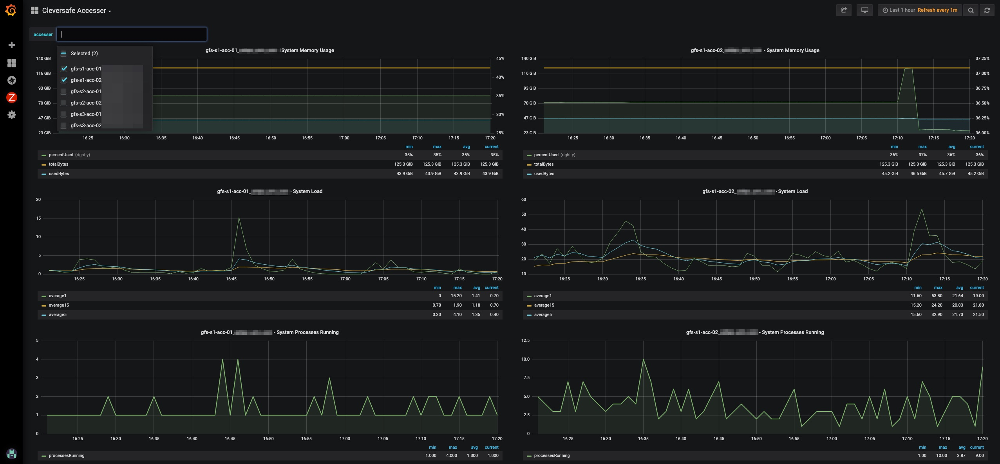

# get_cleversafe_accesser_stats

#### Graphite collection script for Cleversafe Accessers.

---



---

## Use
```bash
python get_cleversafe_accesser_stats.py cleversafe-accesser-01.your.domain.com
```
### The intent of this is to run as a regular cron job, typically on a 1 minute resolution
```bash
* * * * * /usr/bin/python /opt/arm/bin/get_cleversafe_accesser_stats.py cleversafe-accesser-01.your.domain.com >/dev/null 2>&1
```

## Sample output
```bash
python get_cleversafe_accesser_stats.py cleversafe-accesser-01_your_domain_com
cleversafe.accessor.cleversafe-accesser-01_your_domain_com.http.connectionsCurrent 0 1558383410
cleversafe.accessor.cleversafe-accesser-01_your_domain_com.http.connectionsMax 6466 1558383410
cleversafe.accessor.cleversafe-accesser-01_your_domain_com.http.permitsWriters 3233 1558383410
cleversafe.accessor.cleversafe-accesser-01_your_domain_com.http.permitsReaders 3233 1558383410
cleversafe.accessor.cleversafe-accesser-01_your_domain_com.memory.totalBytes 134560845824 1558383410
cleversafe.accessor.cleversafe-accesser-01_your_domain_com.memory.usedBytes 47134363648 1558383410
cleversafe.accessor.cleversafe-accesser-01_your_domain_com.memory.percentUsed 35.0282902574 1558383410
cleversafe.accesser.cleversafe-accesser-01_your_domain_com.request.post.INITIATE_UPLOAD.200 216569 1558383410
cleversafe.accesser.cleversafe-accesser-01_your_domain_com.request.post.OBJECT_MULTI_DELETE.200 158053 1558383410
cleversafe.accesser.cleversafe-accesser-01_your_domain_com.request.post.OBJECT_MULTI_DELETE.499 1 1558383410
cleversafe.accesser.cleversafe-accesser-01_your_domain_com.request.post.OBJECT.403 1 1558383410
cleversafe.accesser.cleversafe-accesser-01_your_domain_com.request.post.COMPLETE_UPLOAD.200 213811 1558383410
cleversafe.accesser.cleversafe-accesser-01_your_domain_com.request.post.COMPLETE_UPLOAD.404 2 1558383410
cleversafe.accesser.cleversafe-accesser-01_your_domain_com.request.put.VAULT_CORS.200 1 1558383410
cleversafe.accesser.cleversafe-accesser-01_your_domain_com.request.put.OBJECT.200 21666637 1558383410
cleversafe.accesser.cleversafe-accesser-01_your_domain_com.request.put.OBJECT.404 8356 1558383410
cleversafe.accesser.cleversafe-accesser-01_your_domain_com.request.put.OBJECT.403 57 1558383410
cleversafe.accesser.cleversafe-accesser-01_your_domain_com.request.put.OBJECT.499 41 1558383410
cleversafe.accesser.cleversafe-accesser-01_your_domain_com.request.put.OBJECT.507 4366076 1558383410
cleversafe.accesser.cleversafe-accesser-01_your_domain_com.request.put.OBJECT.500 12 1558383410
cleversafe.accesser.cleversafe-accesser-01_your_domain_com.request.put.OBJECT_ACL.200 3761 1558383410
cleversafe.accesser.cleversafe-accesser-01_your_domain_com.request.put.OBJECT_TAGGING.400 80341 1558383410
cleversafe.accesser.cleversafe-accesser-01_your_domain_com.request.put.PART.200 1872533 1558383410
cleversafe.accesser.cleversafe-accesser-01_your_domain_com.request.put.PART.404 27 1558383410
cleversafe.accesser.cleversafe-accesser-01_your_domain_com.request.put.PART.499 14 1558383410
cleversafe.accesser.cleversafe-accesser-01_your_domain_com.request.put.PART.500 8 1558383410
cleversafe.accesser.cleversafe-accesser-01_your_domain_com.request.put.PART.507 45901 1558383410
cleversafe.accesser.cleversafe-accesser-01_your_domain_com.request.put.VAULT.403 13512 1558383410
cleversafe.accesser.cleversafe-accesser-01_your_domain_com.request.put.VAULT.409 1 1558383410
cleversafe.accesser.cleversafe-accesser-01_your_domain_com.request.head.VAULT.200 37132 1558383410
cleversafe.accesser.cleversafe-accesser-01_your_domain_com.request.head.VAULT.404 18962 1558383410
cleversafe.accesser.cleversafe-accesser-01_your_domain_com.request.head.VAULT.403 1 1558383410
cleversafe.accesser.cleversafe-accesser-01_your_domain_com.request.head.OBJECT.200 250944578 1558383410
cleversafe.accesser.cleversafe-accesser-01_your_domain_com.request.head.OBJECT.404 41589640 1558383410
cleversafe.accesser.cleversafe-accesser-01_your_domain_com.request.head.OBJECT.403 16 1558383410
cleversafe.accesser.cleversafe-accesser-01_your_domain_com.request.head.SERVICE.403 2 1558383410
cleversafe.accesser.cleversafe-accesser-01_your_domain_com.request.get.VAULT_LOCATION.200 11720 1558383410
cleversafe.accesser.cleversafe-accesser-01_your_domain_com.request.get.VAULT_LOCATION.404 16669 1558383410
cleversafe.accesser.cleversafe-accesser-01_your_domain_com.request.get.VAULT_LOCATION.403 99 1558383410
cleversafe.accesser.cleversafe-accesser-01_your_domain_com.request.get.VAULT_CORS.404 2 1558383410
cleversafe.accesser.cleversafe-accesser-01_your_domain_com.request.get.VAULT_CORS.403 1 1558383410
cleversafe.accesser.cleversafe-accesser-01_your_domain_com.request.get.VAULT_UPLOADS.200 72483 1558383410
cleversafe.accesser.cleversafe-accesser-01_your_domain_com.request.get.SERVICE.200 3750354 1558383410
cleversafe.accesser.cleversafe-accesser-01_your_domain_com.request.get.SERVICE.403 18 1558383410
cleversafe.accesser.cleversafe-accesser-01_your_domain_com.request.get.OBJECT.200 31915229 1558383410
cleversafe.accesser.cleversafe-accesser-01_your_domain_com.request.get.OBJECT.404 3954227 1558383410
cleversafe.accesser.cleversafe-accesser-01_your_domain_com.request.get.OBJECT.403 136 1558383410
cleversafe.accesser.cleversafe-accesser-01_your_domain_com.request.get.OBJECT.500 24 1558383410
cleversafe.accesser.cleversafe-accesser-01_your_domain_com.request.get.OBJECT.206 6923825 1558383410
cleversafe.accesser.cleversafe-accesser-01_your_domain_com.request.get.VAULT_ACL.200 248117 1558383410
cleversafe.accesser.cleversafe-accesser-01_your_domain_com.request.get.VAULT_ACL.403 170 1558383410
cleversafe.accesser.cleversafe-accesser-01_your_domain_com.request.get.OBJECT_ACL.200 1797 1558383410
cleversafe.accesser.cleversafe-accesser-01_your_domain_com.request.get.OBJECT_ACL.404 5 1558383410
cleversafe.accesser.cleversafe-accesser-01_your_domain_com.request.get.VAULT_VERSIONING.403 19309 1558383410
cleversafe.accesser.cleversafe-accesser-01_your_domain_com.request.get.VAULT_REQUEST_PAYMENT.200 2 1558383410
cleversafe.accesser.cleversafe-accesser-01_your_domain_com.request.get.VAULT_VERSION.200 50433 1558383410
cleversafe.accesser.cleversafe-accesser-01_your_domain_com.request.get.UPLOADS.200 9989 1558383410
cleversafe.accesser.cleversafe-accesser-01_your_domain_com.request.get.VAULT_LIFECYCLE.404 5 1558383410
cleversafe.accesser.cleversafe-accesser-01_your_domain_com.request.get.VAULT_WEBSITE.200 1 1558383410
cleversafe.accesser.cleversafe-accesser-01_your_domain_com.request.get.VAULT.200 59506321 1558383410
cleversafe.accesser.cleversafe-accesser-01_your_domain_com.request.get.VAULT.404 8404 1558383410
cleversafe.accesser.cleversafe-accesser-01_your_domain_com.request.get.VAULT.403 88 1558383410
cleversafe.accesser.cleversafe-accesser-01_your_domain_com.request.get.VAULT.500 28 1558383410
cleversafe.accesser.cleversafe-accesser-01_your_domain_com.request.get.VAULT_LOGGING.403 3 1558383410
cleversafe.accesser.cleversafe-accesser-01_your_domain_com.request.get.VAULT_POLICY.404 2 1558383410
cleversafe.accesser.cleversafe-accesser-01_your_domain_com.network.p4p1.receive_frame 0 1558383410
cleversafe.accesser.cleversafe-accesser-01_your_domain_com.network.p4p1.receive_multicast 0 1558383410
cleversafe.accesser.cleversafe-accesser-01_your_domain_com.network.p4p1.receive_packets 0 1558383410
cleversafe.accesser.cleversafe-accesser-01_your_domain_com.network.p4p1.receive_fifo 0 1558383410
cleversafe.accesser.cleversafe-accesser-01_your_domain_com.network.p4p1.transmit_errors 0 1558383410
cleversafe.accesser.cleversafe-accesser-01_your_domain_com.network.p4p1.transmit_drop 0 1558383410
cleversafe.accesser.cleversafe-accesser-01_your_domain_com.network.p4p1.transmit_packets 0 1558383410
cleversafe.accesser.cleversafe-accesser-01_your_domain_com.network.p4p1.receive_compressed 0 1558383410
cleversafe.accesser.cleversafe-accesser-01_your_domain_com.network.p4p1.transmit_carrier 0 1558383410
cleversafe.accesser.cleversafe-accesser-01_your_domain_com.network.p4p1.receive_errors 0 1558383410
cleversafe.accesser.cleversafe-accesser-01_your_domain_com.network.p4p1.transmit_compressed 0 1558383410
cleversafe.accesser.cleversafe-accesser-01_your_domain_com.network.p4p1.transmit_colls 0 1558383410
cleversafe.accesser.cleversafe-accesser-01_your_domain_com.network.p4p1.receive_drop 0 1558383410
cleversafe.accesser.cleversafe-accesser-01_your_domain_com.network.p4p1.in 0 1558383410
cleversafe.accesser.cleversafe-accesser-01_your_domain_com.network.p4p1.transmit_fifo 0 1558383410
cleversafe.accesser.cleversafe-accesser-01_your_domain_com.network.p4p1.out 0 1558383410
cleversafe.accesser.cleversafe-accesser-01_your_domain_com.network.p4p2.receive_frame 0 1558383410
cleversafe.accesser.cleversafe-accesser-01_your_domain_com.network.p4p2.receive_multicast 0 1558383410
cleversafe.accesser.cleversafe-accesser-01_your_domain_com.network.p4p2.receive_packets 0 1558383410
cleversafe.accesser.cleversafe-accesser-01_your_domain_com.network.p4p2.receive_fifo 0 1558383410
cleversafe.accesser.cleversafe-accesser-01_your_domain_com.network.p4p2.transmit_errors 0 1558383410
cleversafe.accesser.cleversafe-accesser-01_your_domain_com.network.p4p2.transmit_drop 0 1558383410
cleversafe.accesser.cleversafe-accesser-01_your_domain_com.network.p4p2.transmit_packets 0 1558383410
cleversafe.accesser.cleversafe-accesser-01_your_domain_com.network.p4p2.receive_compressed 0 1558383410
cleversafe.accesser.cleversafe-accesser-01_your_domain_com.network.p4p2.transmit_carrier 0 1558383410
cleversafe.accesser.cleversafe-accesser-01_your_domain_com.network.p4p2.receive_errors 0 1558383410
cleversafe.accesser.cleversafe-accesser-01_your_domain_com.network.p4p2.transmit_compressed 0 1558383410
cleversafe.accesser.cleversafe-accesser-01_your_domain_com.network.p4p2.transmit_colls 0 1558383410
cleversafe.accesser.cleversafe-accesser-01_your_domain_com.network.p4p2.receive_drop 0 1558383410
cleversafe.accesser.cleversafe-accesser-01_your_domain_com.network.p4p2.in 0 1558383410
cleversafe.accesser.cleversafe-accesser-01_your_domain_com.network.p4p2.transmit_fifo 0 1558383410
cleversafe.accesser.cleversafe-accesser-01_your_domain_com.network.p4p2.out 0 1558383410
cleversafe.accesser.cleversafe-accesser-01_your_domain_com.network.bond0.receive_frame 0 1558383410
cleversafe.accesser.cleversafe-accesser-01_your_domain_com.network.bond0.receive_multicast 484 1558383410
cleversafe.accesser.cleversafe-accesser-01_your_domain_com.network.bond0.receive_packets 132212658113 1558383410
cleversafe.accesser.cleversafe-accesser-01_your_domain_com.network.bond0.receive_fifo 0 1558383410
cleversafe.accesser.cleversafe-accesser-01_your_domain_com.network.bond0.transmit_errors 0 1558383410
cleversafe.accesser.cleversafe-accesser-01_your_domain_com.network.bond0.transmit_drop 3 1558383410
cleversafe.accesser.cleversafe-accesser-01_your_domain_com.network.bond0.transmit_packets 556387633608 1558383410
cleversafe.accesser.cleversafe-accesser-01_your_domain_com.network.bond0.receive_compressed 0 1558383410
cleversafe.accesser.cleversafe-accesser-01_your_domain_com.network.bond0.transmit_carrier 0 1558383410
cleversafe.accesser.cleversafe-accesser-01_your_domain_com.network.bond0.receive_errors 0 1558383410
cleversafe.accesser.cleversafe-accesser-01_your_domain_com.network.bond0.transmit_compressed 0 1558383410
cleversafe.accesser.cleversafe-accesser-01_your_domain_com.network.bond0.transmit_colls 0 1558383410
cleversafe.accesser.cleversafe-accesser-01_your_domain_com.network.bond0.receive_drop 1872136 1558383410
cleversafe.accesser.cleversafe-accesser-01_your_domain_com.network.bond0.in 387963842748179 1558383410
cleversafe.accesser.cleversafe-accesser-01_your_domain_com.network.bond0.transmit_fifo 0 1558383410
cleversafe.accesser.cleversafe-accesser-01_your_domain_com.network.bond0.out 675992356653545 1558383410
cleversafe.accesser.cleversafe-accesser-01_your_domain_com.network.lo.receive_frame 0 1558383410
cleversafe.accesser.cleversafe-accesser-01_your_domain_com.network.lo.receive_multicast 0 1558383410
cleversafe.accesser.cleversafe-accesser-01_your_domain_com.network.lo.receive_packets 2174773345 1558383410
cleversafe.accesser.cleversafe-accesser-01_your_domain_com.network.lo.receive_fifo 0 1558383410
cleversafe.accesser.cleversafe-accesser-01_your_domain_com.network.lo.transmit_errors 0 1558383410
cleversafe.accesser.cleversafe-accesser-01_your_domain_com.network.lo.transmit_drop 0 1558383410
cleversafe.accesser.cleversafe-accesser-01_your_domain_com.network.lo.transmit_packets 2174773345 1558383410
cleversafe.accesser.cleversafe-accesser-01_your_domain_com.network.lo.receive_compressed 0 1558383410
cleversafe.accesser.cleversafe-accesser-01_your_domain_com.network.lo.transmit_carrier 0 1558383410
cleversafe.accesser.cleversafe-accesser-01_your_domain_com.network.lo.receive_errors 0 1558383410
cleversafe.accesser.cleversafe-accesser-01_your_domain_com.network.lo.transmit_compressed 0 1558383410
cleversafe.accesser.cleversafe-accesser-01_your_domain_com.network.lo.transmit_colls 0 1558383410
cleversafe.accesser.cleversafe-accesser-01_your_domain_com.network.lo.receive_drop 0 1558383410
cleversafe.accesser.cleversafe-accesser-01_your_domain_com.network.lo.in 1956953667695 1558383410
cleversafe.accesser.cleversafe-accesser-01_your_domain_com.network.lo.transmit_fifo 0 1558383410
cleversafe.accesser.cleversafe-accesser-01_your_domain_com.network.lo.out 1956953667695 1558383410
cleversafe.accesser.cleversafe-accesser-01_your_domain_com.network.p3p2.receive_frame 0 1558383410
cleversafe.accesser.cleversafe-accesser-01_your_domain_com.network.p3p2.receive_multicast 242 1558383410
cleversafe.accesser.cleversafe-accesser-01_your_domain_com.network.p3p2.receive_packets 1851509 1558383410
cleversafe.accesser.cleversafe-accesser-01_your_domain_com.network.p3p2.receive_fifo 0 1558383410
cleversafe.accesser.cleversafe-accesser-01_your_domain_com.network.p3p2.transmit_errors 0 1558383410
cleversafe.accesser.cleversafe-accesser-01_your_domain_com.network.p3p2.transmit_drop 0 1558383410
cleversafe.accesser.cleversafe-accesser-01_your_domain_com.network.p3p2.transmit_packets 726900 1558383410
cleversafe.accesser.cleversafe-accesser-01_your_domain_com.network.p3p2.receive_compressed 0 1558383410
cleversafe.accesser.cleversafe-accesser-01_your_domain_com.network.p3p2.transmit_carrier 0 1558383410
cleversafe.accesser.cleversafe-accesser-01_your_domain_com.network.p3p2.receive_errors 0 1558383410
cleversafe.accesser.cleversafe-accesser-01_your_domain_com.network.p3p2.transmit_compressed 0 1558383410
cleversafe.accesser.cleversafe-accesser-01_your_domain_com.network.p3p2.transmit_colls 0 1558383410
cleversafe.accesser.cleversafe-accesser-01_your_domain_com.network.p3p2.receive_drop 1851509 1558383410
cleversafe.accesser.cleversafe-accesser-01_your_domain_com.network.p3p2.in 111107565 1558383410
cleversafe.accesser.cleversafe-accesser-01_your_domain_com.network.p3p2.transmit_fifo 0 1558383410
cleversafe.accesser.cleversafe-accesser-01_your_domain_com.network.p3p2.out 90135600 1558383410
cleversafe.accesser.cleversafe-accesser-01_your_domain_com.network.p3p1.receive_frame 0 1558383410
cleversafe.accesser.cleversafe-accesser-01_your_domain_com.network.p3p1.receive_multicast 242 1558383410
cleversafe.accesser.cleversafe-accesser-01_your_domain_com.network.p3p1.receive_packets 132210806604 1558383410
cleversafe.accesser.cleversafe-accesser-01_your_domain_com.network.p3p1.receive_fifo 0 1558383410
cleversafe.accesser.cleversafe-accesser-01_your_domain_com.network.p3p1.transmit_errors 0 1558383410
cleversafe.accesser.cleversafe-accesser-01_your_domain_com.network.p3p1.transmit_drop 0 1558383410
cleversafe.accesser.cleversafe-accesser-01_your_domain_com.network.p3p1.transmit_packets 556386906708 1558383410
cleversafe.accesser.cleversafe-accesser-01_your_domain_com.network.p3p1.receive_compressed 0 1558383410
cleversafe.accesser.cleversafe-accesser-01_your_domain_com.network.p3p1.transmit_carrier 0 1558383410
cleversafe.accesser.cleversafe-accesser-01_your_domain_com.network.p3p1.receive_errors 0 1558383410
cleversafe.accesser.cleversafe-accesser-01_your_domain_com.network.p3p1.transmit_compressed 0 1558383410
cleversafe.accesser.cleversafe-accesser-01_your_domain_com.network.p3p1.transmit_colls 0 1558383410
cleversafe.accesser.cleversafe-accesser-01_your_domain_com.network.p3p1.receive_drop 0 1558383410
cleversafe.accesser.cleversafe-accesser-01_your_domain_com.network.p3p1.in 387963731640614 1558383410
cleversafe.accesser.cleversafe-accesser-01_your_domain_com.network.p3p1.transmit_fifo 0 1558383410
cleversafe.accesser.cleversafe-accesser-01_your_domain_com.network.p3p1.out 675992266517945 1558383410
cleversafe.accesser.cleversafe-accesser-01_your_domain_com.load.processesRunning 1 1558383410
cleversafe.accesser.cleversafe-accesser-01_your_domain_com.load.average5 6 1558383410
cleversafe.accesser.cleversafe-accesser-01_your_domain_com.load.average15 7 1558383410
cleversafe.accesser.cleversafe-accesser-01_your_domain_com.load.average1 2 1558383410
cleversafe.accesser.cleversafe-accesser-01_your_domain_com.load.processesTotal 870 1558383410
cleversafe.accesser.cleversafe-accesser-01_your_domain_com.memory.system.totalBytes 134560845824 1558383410
cleversafe.accesser.cleversafe-accesser-01_your_domain_com.memory.system.usedBytes 47134363648 1558383410
cleversafe.accesser.cleversafe-accesser-01_your_domain_com.memory.system.percentUsed 35.0282902574 1558383410
cleversafe.accesser.cleversafe-accesser-01_your_domain_com.memory.offHeap.totalBytes 51539607552 1558383410
cleversafe.accesser.cleversafe-accesser-01_your_domain_com.memory.offHeap.usedBytes 6358564864 1558383410
cleversafe.accesser.cleversafe-accesser-01_your_domain_com.memory.offHeap.percentUsed 12.3372395833 1558383410
cleversafe.accesser.cleversafe-accesser-01_your_domain_com.memory.memoryManager.totalBytes 33540265431 1558383410
cleversafe.accesser.cleversafe-accesser-01_your_domain_com.memory.memoryManager.usedBytes 67098071 1558383410
cleversafe.accesser.cleversafe-accesser-01_your_domain_com.memory.memoryManager.percentUsed 0.200052295764 1558383410
cleversafe.accesser.cleversafe-accesser-01_your_domain_com.memory.direct.totalBytes 134560845824 1558383410
cleversafe.accesser.cleversafe-accesser-01_your_domain_com.memory.direct.usedBytes 4896842 1558383410
cleversafe.accesser.cleversafe-accesser-01_your_domain_com.memory.direct.percentUsed 0.00363912843295 1558383410
cleversafe.accesser.cleversafe-accesser-01_your_domain_com.memory.onHeap.totalBytes 9437184000 1558383410
cleversafe.accesser.cleversafe-accesser-01_your_domain_com.memory.onHeap.usedBytes 1887436800 1558383410
cleversafe.accesser.cleversafe-accesser-01_your_domain_com.memory.onHeap.percentUsed 20.0 1558383410
```
